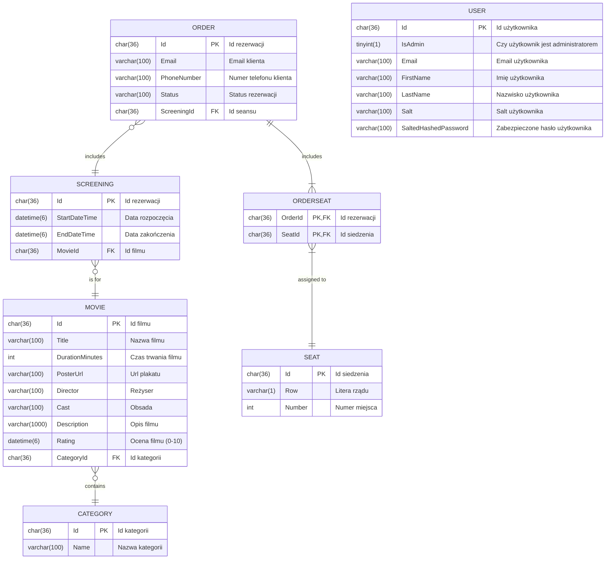

# System do zarządzania kinem studyjnym

### main
[cinema.nkaczmarek.pl](https://cinema.nkaczmarek.pl)\
[admin panel](https://cinema.nkaczmarek.pl/admin)\
[swagger](https://cinema.nkaczmarek.pl/swagger)

### develop
[develop.cinema.nkaczmarek.pl](https://develop.cinema.nkaczmarek.pl)\
[admin panel](https://develop.cinema.nkaczmarek.pl/admin)\
[swagger](https://develop.cinema.nkaczmarek.pl/swagger)

## Database diagram

