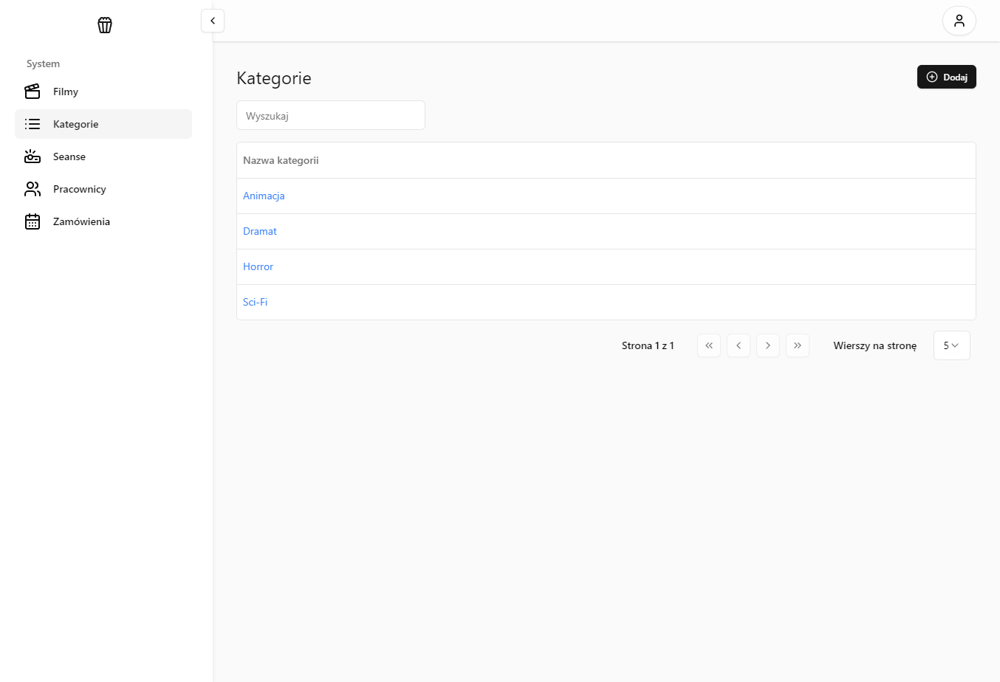
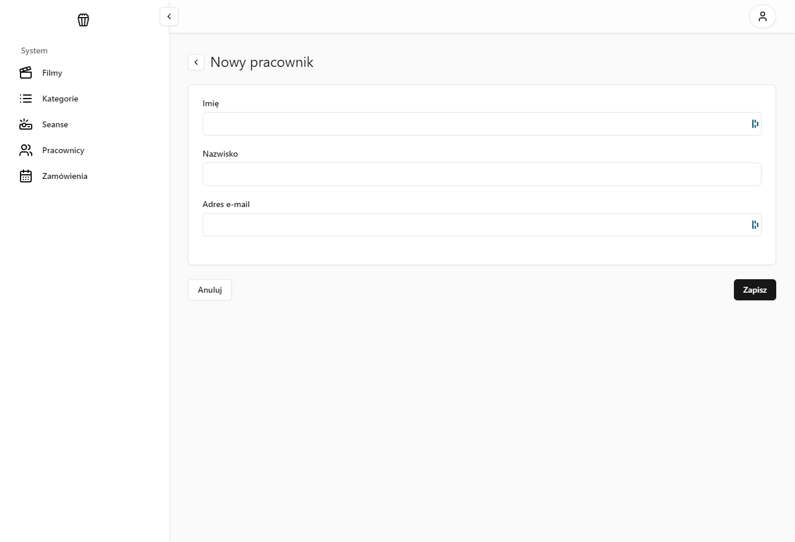

# Dokumentacja Aplikacji Kina Studyjnego

## Wprowadzenie
Aplikacja kina studyjnego wspiera zarówno pracowników, jak i klientów. Zapewnia funkcjonalności takie jak zarządzanie filmami, kategoriami, seansami, pracownikami oraz rezerwacjami w panelu administracyjnym, a także przeglądanie harmonogramu, szczegółów filmów oraz rezerwację biletów z miejscami przez klientów.

## Główne funkcje aplikacji

### Moduł administracyjny
Umożliwia:

- Zarządzanie filmami: Dodawanie, edycja i usuwanie filmów.
- Zarządzanie kategoriami: Tworzenie i edytowanie kategorii filmowych.
- Zarządzanie seansami: Tworzenie harmonogramów i przypisywanie filmów do terminów.
- Obsługę zamówień: Zarządzanie rezerwacjami, zmiana statusów.
- Zarządzanie użytkownikami: Tworzenie i aktualizacja kont pracowników.

### Moduł kliencki
Umożliwia:

- Przeglądanie filmów: Szczegóły filmów, takie jak opis, obsada, reżyseria, plakaty i oceny.
- Harmonogram seansów: Lista seansów z możliwością rezerwacji miejsc.
- Rezerwację miejsc: Wybór seansu i miejsc w sali.
- Zarządzanie rezerwacjami: Śledzenie i aktualizacja rezerwacji.

## Architektura aplikacji
- Frontend:
    - React, TypeScript, Vite
    - Tailwind CSS, Tanstack 
- Backend:
    - ASP.NET Core
    - Entity Framework Core, MySQL

## Przyszłe plany
- Integracja płatności online (Stripe, PayU).
- System powiadomień SMS/Email.
- Algorytm rekomendacji filmów.
- Aplikacja mobilna.

## Demo

### main
[cinema.nkaczmarek.pl](https://cinema.nkaczmarek.pl)\
[admin panel](https://cinema.nkaczmarek.pl/admin)\
[swagger](https://cinema.nkaczmarek.pl/swagger)

### develop
[develop.cinema.nkaczmarek.pl](https://develop.cinema.nkaczmarek.pl)\
[admin panel](https://develop.cinema.nkaczmarek.pl/admin)\
[swagger](https://develop.cinema.nkaczmarek.pl/swagger)

## Database diagram

## Zrzuty ekranu

*Zrzut ekranu nr 1: Główna strona kina - przedstawia karuzelę z ostatnio dodanymi filamami oraz repertuarem na najbliższe 7 dni.*

*Zrzut ekranu nr 2: Strona konkrentego filmu - przedstawia kategorię, opinię, opis, czas trwania, 5 najbliższych seansów oraz zwiastun.*

*Zrzut ekranu nr 3: Strona wyboru miejsc - zielone miejsca są wolne, czerwone zajęte, pomarańczowe wybrane przez klienta.*

*Zrzut ekranu nr 4: Strona zamawiania filmu - klient potwierdza zamówienie i podaje swoje dane.*

*Zrzut ekranu nr 5: Email, który natychmiatowo przychodzi na maila, widzimy dane dotyczące seansu, naszych miejsc oraz kod identyfikujący nasz bilet.*

*Zrzut ekranu nr 6: Strona logowania dla pracowników kina - zalogować się mogą jedynie pracownicy, konta tworzy administrator.*

*Zrzut ekranu nr 7: Strona z filmami - umożliwia podgląd, edycję, dodanie oraz usunięcie.*

*Zrzut ekranu nr 8: Strona do podglądu i edycji konkretnego filmu.*

*Zrzut ekranu nr 9: Strona z kategoriami filmów - umożliwia podgląd, edycję, dodanie oraz usunięcie.*

*Zrzut ekranu nr 10: Strona z seansami - umożliwia podgląd, edycję, dodanie oraz usunięcie.*

*Zrzut ekranu nr 11: Strona z pracownikami - umożliwia dodanie, usunięcie oraz reset hasła.*

*Zrzut ekranu nr 12: Strona dodawania nowego pracownika - automatycznie wygenerowane hasło zostanie wysłane na maila pracownika.*

*Zrzut ekranu nr 13: Strona z zamówieniami - umożliwia wyszukiwanie po email oraz kodzie, opłatę zamówienia oraz anulowanie.*

*Zrzut ekranu nr 14: Strona podglądu użytkownika - umożliwia samodzielną edycję hasła.*

*Zrzut ekranu nr 15: Email, który przychodzi do pracownika po założeniu konta lub odgórnym resecie hasła.*

## Zrzuty ekranu endpointów

*Zrzut ekranu nr 16: Zrzut ekranu endpointów pracownika.*

*Zrzut ekranu nr 17: Zrzut ekranu endpointów klienta.*